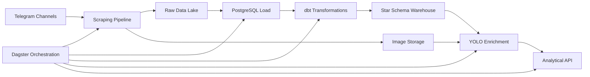

# Medical Telegram Data Pipeline

## 📋 **Project Overview**

An end-to-end data pipeline for analyzing Ethiopian medical businesses using Telegram data. This project scrapes data from public Telegram channels, transforms it into a structured data warehouse, enriches it with computer vision, and exposes insights through an analytical API.

**Date**: 14 Jan - 20 Jan 2026  
**Challenge**: 10 Academy - KAIM 8 - Week 8

## 🎯 **Business Need**

Kara Solutions, a leading data science consultancy in Ethiopia, needs to build a robust data platform that generates actionable insights about Ethiopian medical businesses using data scraped from public Telegram channels.

### Key Business Questions:
- What are the top 10 most frequently mentioned medical products/drugs?
- How do prices/availability vary across different channels?
- Which channels have the most visual content (pills vs creams)?
- What are the daily/weekly trends in posting volume for health topics?

## 🏗️ **Architecture**



## 📁 **Project Structure**
```bash
medical-telegram-pipeline/
├── config/           # Configuration files
├── data/            # Data storage (gitignored)
├── src/             # Source code
├── dbt_medical/     # dbt transformation project
├── logs/            # Log files (gitignored)
├── api/             # FastAPI application
├── docker/          # Docker configurations
└── docs/            # Documentation
```

## **Quick Start**
### 1. **Prerequisites**

- Python 3.8+
- Docker and Docker Compose
- PostgreSQL 15+
- Telegram API credentials

### 2. **Clone and Setup**
```bash
git clone https://github.com/Jaki77/medical-telegram-warehouse.git
cd medical-telegram-pipeline

# Create virtual environment
python -m venv venv
source venv/bin/activate  # On Windows: venv\Scripts\activate

# Install dependencies
pip install -r requirements.txt
```

### 3. **Configure Environment**
```bash
# Copy environment template
cp config/.env

# Edit config/.env with your credentials:
# - Telegram API credentials from https://my.telegram.org
# - Database credentials
# - Telegram channels to scrape
```

### 4. **Start Infrastructure**
```bash
# Start PostgreSQL database
docker-compose up -d postgres

# Verify database is running
docker ps
```

### 5. **Run Complete Pipeline**
```bash
# Option 1: Run all tasks sequentially
python run_scraper.py   # Task 1: Scraping
python run_transform.py   # Task 2: Data Warehouse
# ... continue with Tasks 3-5

# Option 2: Run with orchestration (Task 5)
python src/orchestrate.py
```

## **Data Warehouse Schema**
```
┌─────────────────┐      ┌─────────────────┐
│   dim_channels  │      │    dim_dates    │
├─────────────────┤      ├─────────────────┤
│ channel_key (PK)│      │ date_key (PK)   │
│ channel_name    │      │ full_date       │
│ channel_type    │      │ year, quarter   │
│ total_posts     │      │ month, week     │
│ avg_views       │      │ day_of_week     │
│ image_percentage│      │ is_weekend      │
└─────────────────┘      └─────────────────┘
         │                       │
         └───────────┬───────────┘
                     │
               ┌─────────────────┐
               │  fct_messages   │
               ├─────────────────┤
               │ message_key (PK)│
               │ channel_key (FK)│
               │ date_key (FK)   │
               │ message_text    │
               │ view_count      │
               │ forward_count   │
               │ has_image_flag  │
               └─────────────────┘
```